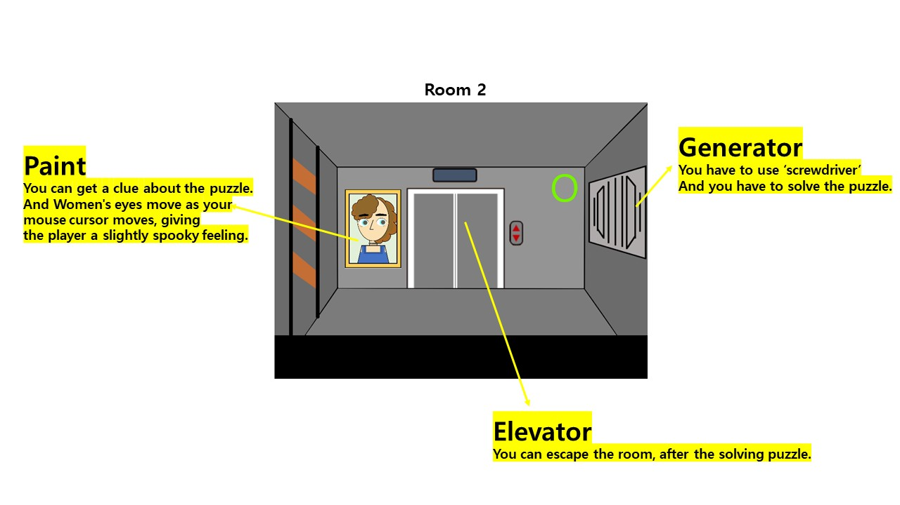

### High concept
This game is "escape game". player have to escape the room to pick up some useful and solve the puzzles.

### Take One, Leave The Rest
I used this theme in the overall content of the game. 
This escape game is designed to leave the room with only one piece of information, clues, and objects in one room, rather than collecting evidence from one room.
- such as screwdriver in first room and open the generator in second room ect..

### Mock Ups

